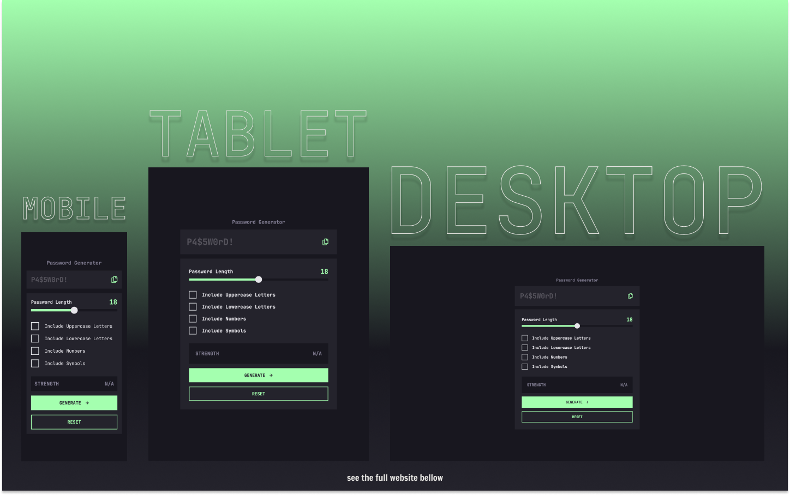

# Frontend Mentor - Password Generator App Solution

This is a solution to the [Password Generator App Challenge on Frontend Mentor](https://www.frontendmentor.io/challenges/password-generator-app-Mr8CLycqjh).

## Table of contents

- [Overview](#overview)
  - [The challenge](#the-challenge)
  - [Screenshot](#screenshot)
  - [Links](#links)
- [My process](#my-process)
  - [Built with](#built-with)
  - [What I learned](#what-i-learned)
  - [Continued development](#continued-development)
  - [Useful resources](#useful-resources)
- [Author's Links](#authors-links)

## Overview

### The challenge

Users should be able to:

- Generate a password based on the selected inclusion options
- Copy the generated password to the computer's clipboard
- See a strength rating for their generated password
- View the optimal layout for the interface depending on their device's screen size
- See hover and focus states for all interactive elements on the page

### Screenshot

### Links

- Live Site URL: [https://password-generator-app-tawny.vercel.app/](https://password-generator-app-tawny.vercel.app/)
- Solution URL: [TO_BE_UPDATED](TO_BE_UPDATED)

## My process

### Built with

  

### What I learned

The main purpose of this project was to practice my TypeScript skills. To me, it seemed a great project specifically to practice TypeScript because there was a lot going on in terms of types. Before using TypeScript, I thought that it's going to make things difficult, because my code will become more verbose and hard to read. On contrary, the code may have a couple more words, but it will definitely help you to understand of what the code is supposed to do. There's much more to learn in TypeScript and to practice it as well. However, for the first project, I think this was perfect.

### Useful resources

- [Flowbite](https://flowbite.com/docs/forms/range/) - Flowbite is a Tailwind UI library, that helped me with the range slider's and checkboxes' base design. You should definitely check it out because they have much more to offer.
- [React TypeScript Cheat Sheet](https://react-typescript-cheatsheet.netlify.app/docs/basic/useful-hooks) - Since there's no official documentation on how to use TypeScript w/React, this seems to be one of the best options.
- [React and TypeScript: Finding the right event type](https://felixgerschau.com/react-typescript-events/) - This article helped me a lot with the event types and how to choose them wisely.
- [usehooks-ts](https://usehooks-ts.com/react-hook/use-debounce) - Cool library, that will help you with pre-made hooks. Also, very helpful to get to know the syntax of TypeScript in React.

## Author's Links

- Medium - [@kens_visuals](https://medium.com/@kens_visuals)
- CodePen - [@kens-visuals](https://codepen.io/kens-visuals)
- Codewars - [@kens_visuals](https://www.codewars.com/users/kens_visuals)
- Frontend Mentor - [@kens-visuals](https://www.frontendmentor.io/profile/kens-visuals)
